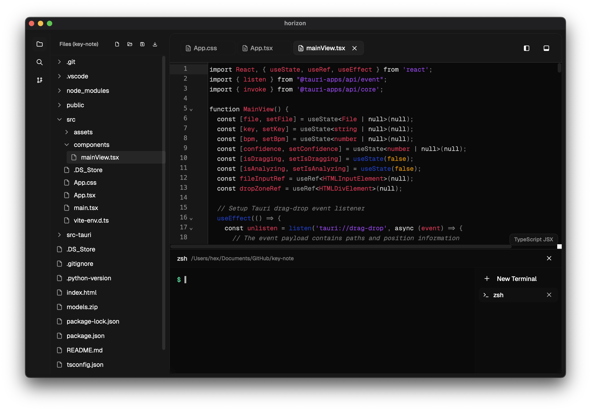

# Horizon

<div align="center">

> ⚠️ **Note:** This project is currently under active development and may contain bugs or incomplete features. Use at your own risk.

[](https://opensource.org/licenses/MIT)
[](https://tauri.app)
[](https://reactjs.org)
[](https://www.typescriptlang.org)
[](https://tailwindcss.com)
[](https://codemirror.net)

[](https://github.com/66HEX/horizon/stargazers)
[](https://github.com/66HEX/horizon/network/members)
[](https://github.com/66HEX/horizon/issues)
[](https://github.com/66HEX/horizon/pulls)

[](https://github.com/66HEX/horizon/releases)
[](https://github.com/66HEX/horizon/releases)
[](https://github.com/66HEX/horizon/releases/latest)



</div>

A modern, desktop-based code editor built with Tauri, React, and TypeScript. This application provides a powerful and customizable coding environment with integrated terminal support and file system management.

## Features

### Core Editor
- High-performance native application powered by Tauri
- Advanced syntax highlighting for multiple programming languages
- Sophisticated UI leveraging Tailwind CSS and Radix UI components
- Comprehensive file and content search capabilities
- Seamless file system integration with intuitive directory navigation
- Professional-grade integrated terminal with multi-instance support
- Intelligent code completion and real-time linting
- Elegant dark theme optimized for extended coding sessions
- Adaptive responsive design for various screen sizes

### Terminal Integration
- Enterprise-grade terminal implementation with native process management
- Support for multiple concurrent terminal instances
- Advanced process tracking and management capabilities
- Persistent command history for improved workflow
- Cross-platform compatibility (Windows, macOS, Linux)
- Intelligent working directory synchronization
- Robust signal handling (SIGINT, SIGTERM)
- Smart URL detection and handling
- Secure ANSI escape sequence processing

### File Management
- Intuitive file tree navigation system
- Advanced file and content search functionality
- Comprehensive file operations (open, save, save as)
- Visual directory structure representation
- Integrated image file preview capabilities
- Efficient multiple file tab management

## Tech Stack

### Frontend
- React 18
- TypeScript
- Tailwind CSS
- Radix UI
- CodeMirror 6

### Backend (Tauri/Rust)
- Tauri 2.0
- Rust
- sysinfo for process tracking
- tauri-plugin-fs for file system operations
- tauri-plugin-shell for terminal integration
- tauri-plugin-dialog for native dialogs
- tauri-plugin-process for process management

## Supported Languages
- JavaScript/TypeScript (js, jsx, ts, tsx)
- HTML/CSS
- Python
- Java
- C/C++
- Rust
- PHP
- SQL
- Markdown
- YAML
- JSON
- XML
- SASS/LESS
- Shell scripts
- And more...

## Getting Started

### Prerequisites
- Node.js (Latest LTS version)
- Rust (Latest stable version)
- Tauri CLI

### Installation

1. Clone the repository:
```bash
git clone https://github.com/66HEX/horizon.git
cd horizon
```

2. Install dependencies:
```bash
npm install
```

3. Run the development server:
```bash
npm run tauri dev
```

### Building for Production
```bash
npm run tauri build
```

## Project Structure

### Frontend (`src/`)
- `components/` - React components
  - `code-editor.tsx` - Main editor component
  - `terminal.tsx` - Custom terminal implementation
  - `app-sidebar.tsx` - File navigation sidebar
  - `image-viewer.tsx` - Image preview component
  - `ui/` - Reusable UI components
- `lib/` - Core functionality
  - `file-context.tsx` - File management context
  - `file-service.ts` - File operations service

### Backend (`src-tauri/`)
- `src/`
  - `main.rs` - Application entry point
  - `lib.rs` - Library initialization
  - `terminal.rs` - Terminal management
  - `process_tracker.rs` - Process tracking

## Roadmap

### High Priority
- [ ] LSP Server integration for enhanced language support
- [ ] Git integration with full GitHub support
- [ ] Settings panel with comprehensive configuration options
- [ ] Extensions and plugins system
- [ ] GitHub Actions autobuild pipeline

### Medium Priority
- [ ] AI-powered chat assistant for code help
- [ ] Debugging support with breakpoints and variable inspection
- [ ] Code analysis tools for better code quality
- [ ] Linting and Prettier integration
- [ ] Multiplayer collaboration features
- [ ] Integrated project management system - Not just a code editor, but also a tool for task and project management
- [ ] Advanced data visualization - Interactive charts, data structure visualizations, integrated notebooks
- [ ] Code presentation mode - Features that facilitate presenting and discussing code during meetings or recordings

### Low Priority
- [ ] Additional theme support and customization
- [ ] Advanced code refactoring tools
- [ ] Performance optimization
- [ ] Documentation improvements

## Contributing

Contributions are welcome! Please feel free to submit a Pull Request.

## License

This project is licensed under the MIT License - see the LICENSE file for details.

## Acknowledgments

- Tauri team for the excellent desktop framework
- CodeMirror team for the powerful editor framework
- All contributors and supporters of the project